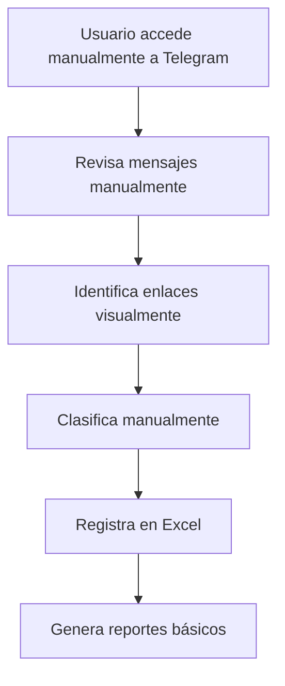
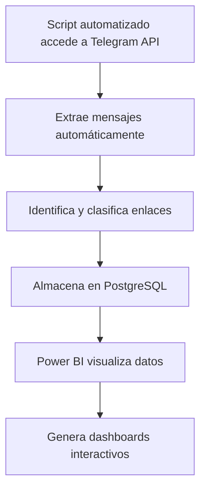
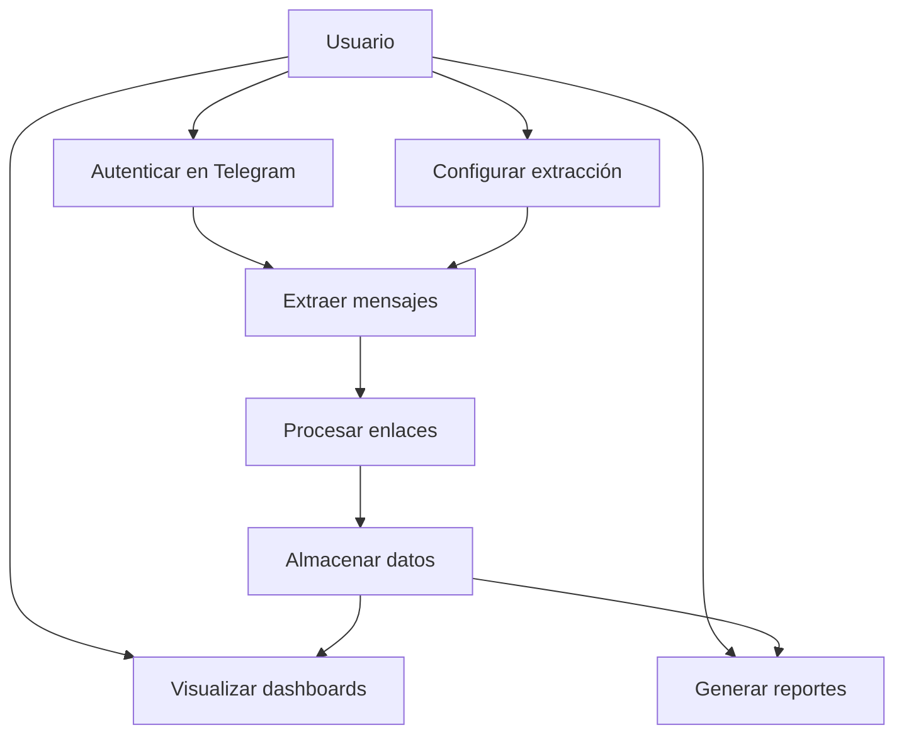
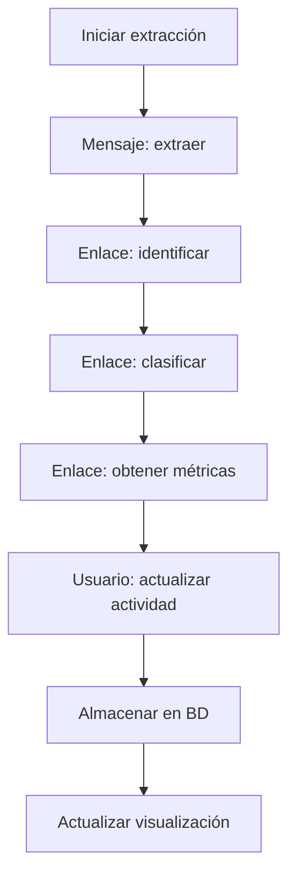
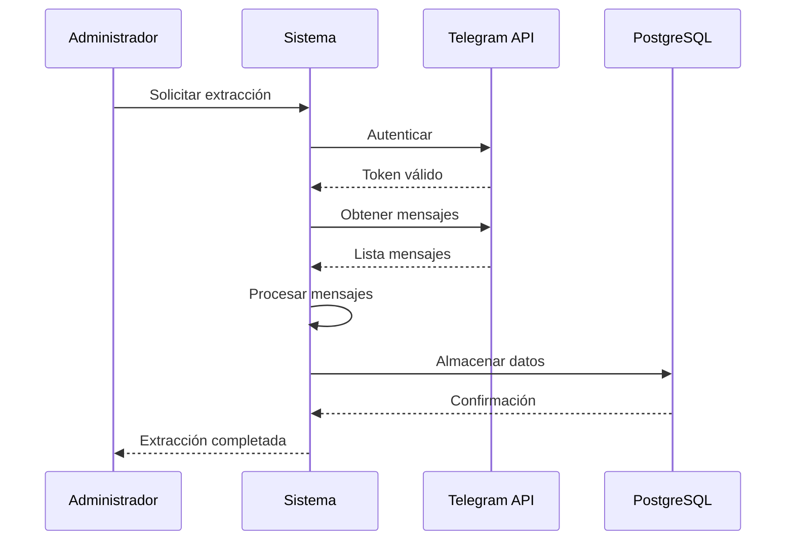
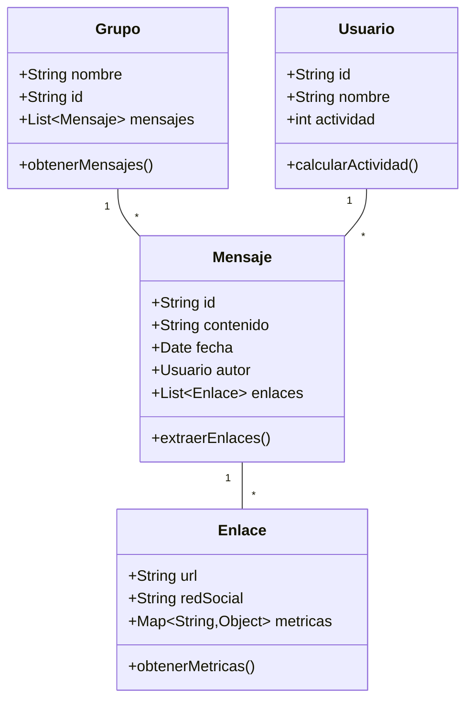

# Documento de Especificación de Requerimientos de Software
## Análisis de Uso de Redes Sociales en Grupos de Telegram

<p align="center">
  
  
  **UNIVERSIDAD PRIVADA DE TACNA**  
  **FACULTAD DE INGENIERÍA**  
  **Escuela Profesional de Ingeniería de Sistemas**
</p>

<p align="center">
  <strong>Proyecto: Análisis de Uso de Redes Sociales en Grupos de Telegram</strong>
</p>

---

**Curso:** Inteligencia de Negocios  
**Docente:** Patrick Jose Cuadros Quiroga  

**Integrantes:**
- **César Nikolas Camac Meléndez (2022074262)**
- **Jefferson Rosas Chambilla (2021072618)**

**Tacna – Perú**  
**2025**

---

## 📋 Control de Versiones

| Versión | Hecha por | Revisada por | Aprobada por | Fecha      | Motivo            |
|---------|-----------|--------------|--------------|------------|-------------------|
| 1.0     | MPV       | ELV          | ARV          | 10/10/2020 | Versión Original |

---

## 📑 Índice General

1. [Introducción](#1-introducción)
2. [Generalidades de la Empresa](#2-generalidades-de-la-empresa)
   - 2.1. [Nombre de la Empresa](#21-nombre-de-la-empresa)
   - 2.2. [Visión](#22-visión)
   - 2.3. [Misión](#23-misión)
   - 2.4. [Organigrama](#24-organigrama)
3. [Visionamiento de la Empresa](#3-visionamiento-de-la-empresa)
   - 3.1. [Descripción del Problema](#31-descripción-del-problema)
   - 3.2. [Objetivos de Negocios](#32-objetivos-de-negocios)
   - 3.3. [Objetivos de Diseño](#33-objetivos-de-diseño)
   - 3.4. [Alcance del Proyecto](#34-alcance-del-proyecto)
   - 3.5. [Viabilidad del Sistema](#35-viabilidad-del-sistema)
   - 3.6. [Información del Levantamiento de Información](#36-información-del-levantamiento-de-información)
4. [Análisis de Procesos](#4-análisis-de-procesos)
   - 4.1. [Diagrama del Proceso Actual](#41-diagrama-del-proceso-actual)
   - 4.2. [Diagrama del Proceso Propuesto](#42-diagrama-del-proceso-propuesto)
5. [Especificación de Requerimientos de Software](#5-especificación-de-requerimientos-de-software)
   - 5.1. [Requerimientos Funcionales Iniciales](#51-requerimientos-funcionales-iniciales)
   - 5.2. [Requerimientos No Funcionales](#52-requerimientos-no-funcionales)
   - 5.3. [Requerimientos Funcionales Finales](#53-requerimientos-funcionales-finales)
   - 5.4. [Reglas de Negocio](#54-reglas-de-negocio)
6. [Fase de Desarrollo](#6-fase-de-desarrollo)
   - 6.1. [Perfiles de Usuario](#61-perfiles-de-usuario)
   - 6.2. [Modelo Conceptual](#62-modelo-conceptual)
     - 6.2.1. [Diagrama de Paquetes](#621-diagrama-de-paquetes)
     - 6.2.2. [Diagrama de Casos de Uso](#622-diagrama-de-casos-de-uso)
     - 6.2.3. [Escenarios de Caso de Uso](#623-escenarios-de-caso-de-uso)
   - 6.3. [Modelo Lógico](#63-modelo-lógico)
     - 6.3.1. [Análisis de Objetos](#631-análisis-de-objetos)
     - 6.3.2. [Diagrama de Actividades con Objetos](#632-diagrama-de-actividades-con-objetos)
     - 6.3.3. [Diagrama de Secuencia](#633-diagrama-de-secuencia)
     - 6.3.4. [Diagrama de Clases](#634-diagrama-de-clases)
7. [Conclusiones](#7-conclusiones)
8. [Recomendaciones](#8-recomendaciones)
9. [Bibliografía](#9-bibliografía)
10. [Webgrafía](#10-webgrafía)

---

## 1. Introducción

Este documento presenta la especificación de requerimientos para el sistema "Análisis de Uso de Redes Sociales en Grupos de Telegram". El sistema tiene como objetivo principal analizar y visualizar el comportamiento de usuarios en grupos de Telegram, específicamente en cuanto al uso y distribución de enlaces hacia diferentes redes sociales.

---

## 2. Generalidades de la Empresa

### 2.1. Nombre de la Empresa
Universidad Privada de Tacna - Facultad de Ingeniería

### 2.2. Visión
Ser la institución líder en formación de ingenieros de sistemas con capacidad de innovación y desarrollo tecnológico.

### 2.3. Misión
Formar profesionales competentes en ingeniería de sistemas mediante una educación de calidad, investigación e innovación tecnológica.

### 2.4. Organigrama
```
Rectorado
└── Facultad de Ingeniería
    └── Escuela de Ingeniería de Sistemas
        └── Departamento Académico
            └── Docentes y Estudiantes
```

---

## 3. Visionamiento de la Empresa

### 3.1. Descripción del Problema
Actualmente no existe una herramienta automatizada que permita analizar cuantitativamente el uso de redes sociales en grupos de Telegram, dificultando la identificación de patrones de comportamiento y tendencias de contenido.

### 3.2. Objetivos de Negocios
- Analizar el comportamiento de usuarios en grupos de Telegram
- Identificar redes sociales más compartidas
- Generar reportes estadísticos para toma de decisiones

### 3.3. Objetivos de Diseño
- Desarrollar sistema automatizado de extracción de datos
- Crear dashboards interactivos con Power BI
- Garantizar escalabilidad y mantenibilidad del sistema

### 3.4. Alcance del Proyecto
- Extracción de mensajes de grupos de Telegram
- Clasificación de enlaces por red social
- Obtención de métricas de interacción
- Visualización de datos en Power BI

### 3.5. Viabilidad del Sistema
✅ **Técnica**: Uso de tecnologías open-source (Python, PostgreSQL, Power BI)  
✅ **Económica**: Costos mínimos de implementación  
✅ **Operativa**: Personal capacitado disponible  

### 3.6. Información del Levantamiento de Información
- Entrevistas con usuarios potenciales
- Análisis de grupos de Telegram existentes
- Investigación de APIs disponibles (Telegram, redes sociales)

---

## 4. Análisis de Procesos

### 4.1. Diagrama del Proceso Actual


### 4.2. Diagrama del Proceso Propuesto


---

## 5. Especificación de Requerimientos de Software

### 5.1. Requerimientos Funcionales Iniciales

| ID | Descripción | Prioridad |
|----|-------------|-----------|
| RF01 | Extraer mensajes de grupos de Telegram | Alta |
| RF02 | Identificar enlaces en mensajes | Alta |
| RF03 | Clasificar enlaces por red social | Alta |

### 5.2. Requerimientos No Funcionales

| ID | Categoría | Descripción | Prioridad |
|----|-----------|-------------|-----------|
| RNF01 | Rendimiento | Procesar 1000 mensajes en <5 min | Media |
| RNF02 | Usabilidad | Interface intuitiva en Power BI | Alta |
| RNF03 | Seguridad | Manejo seguro de credenciales | Alta |
| RNF04 | Escalabilidad | Soporte para múltiples grupos | Baja |

### 5.3. Requerimientos Funcionales Finales

| ID | Descripción | Prioridad |
|----|-------------|-----------|
| RF01 | Autenticación con API de Telegram | Alta |
| RF02 | Extracción automática de mensajes | Alta |
| RF03 | Detección de enlaces en contenido | Alta |
| RF04 | Clasificación por red social | Alta |
| RF05 | Obtención de métricas de interacción | Media |
| RF06 | Almacenamiento en PostgreSQL | Alta |
| RF07 | Generación de datasets para Power BI | Alta |
| RF08 | Visualización en dashboards | Alta |
| RF09 | Filtrado por fechas | Media |
| RF10 | Reportes de usuarios más activos | Media |

### 5.4. Reglas de Negocio

| ID | Regla | Descripción |
|----|-------|-------------|
| RN01 | Acceso a grupos | Solo grupos públicos o con permisos |
| RN02 | Frecuencia de extracción | Máximo 1 extracción por hora por grupo |
| RN03 | Clasificación de redes | Facebook, Instagram, Twitter, YouTube, TikTok |
| RN04 | Retención de datos | Datos se conservan por 6 meses |
| RN05 | Métricas obtenidas | Likes, comentarios, fecha de publicación |

---

## 6. Fase de Desarrollo

### 6.1. Perfiles de Usuario

| Perfil | Descripción | Responsabilidades |
|--------|-------------|-------------------|
| Administrador | Gestiona sistema completo | Configuración, monitoreo |
| Analista | Usuario final de dashboards | Análisis de datos, reportes |
| Desarrollador | Mantenimiento del sistema | Actualizaciones, mejoras |

### 6.2. Modelo Conceptual

#### 6.2.1. Diagrama de Paquetes
```
com.upt.telegram.analysis
├── extraction (Extracción de datos)
├── processing (Procesamiento)
├── database (Gestión BD)
└── visualization (Visualización)
```

#### 6.2.2. Diagrama de Casos de Uso


#### 6.2.3. Escenarios de Caso de Uso

**Caso de Uso: Extraer y Analizar Mensajes**

**Actor:** Administrador

**Flujo Principal:**
1. Sistema autentica con API de Telegram
2. Administrador selecciona grupo a analizar
3. Sistema extrae mensajes del grupo
4. Sistema identifica y clasifica enlaces
5. Sistema almacena datos en PostgreSQL
6. Sistema actualiza datasets de Power BI
7. Administrador visualiza resultados

**Flujos Alternativos:**
- Error de autenticación: Sistema notifica y solicita credenciales
- Grupo privado: Sistema solicita permisos adicionales

### 6.3. Modelo Lógico

#### 6.3.1. Análisis de Objetos

**Clase Mensaje:**
- Atributos: id, contenido, fecha, autor, grupo
- Métodos: extraerEnlaces(), clasificar()

**Clase Enlace:**
- Atributos: url, red_social, métricas, fecha_deteccion
- Métodos: obtenerMetricas(), validar()

**Clase Usuario:**
- Atributos: id, nombre, actividad, grupo
- Métodos: calcularActividad(), generarReporte()

#### 6.3.2. Diagrama de Actividades con Objetos


#### 6.3.3. Diagrama de Secuencia

**Secuencia: Procesamiento de Mensaje**


#### 6.3.4. Diagrama de Clases


---

## 7. Conclusiones

El sistema de análisis de uso de redes sociales en grupos de Telegram permitirá obtener insights valiosos sobre el comportamiento de usuarios y las tendencias de contenido, facilitando la toma de decisiones basada en datos.

---

## 8. Recomendaciones

- Implementar autenticación de dos factores para acceso a APIs
- Considerar el análisis de sentimiento en futuras versiones
- Establecer políticas claras de privacidad y uso de datos

---

## 9. Bibliografía

- Sommerville, Ian. "Ingeniería de Software"
- Pressman, Roger. "Ingeniería del Software: Un enfoque práctico"

---

## 10. Webgrafía

- https://core.telegram.org/api
- https://docs.microsoft.com/power-bi/
- https://www.postgresql.org/docs/

---

*Documento elaborado como parte del curso de Inteligencia de Negocios - Universidad Privada de Tacna 2025*
